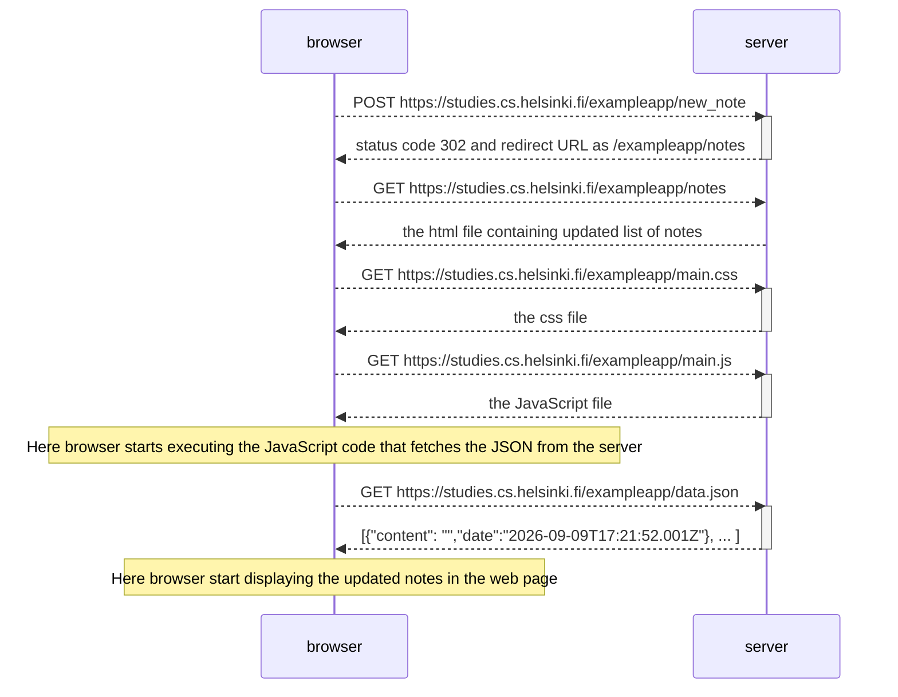

```mermaid
sequenceDiagram

    browser -->> server: POST https://studies.cs.helsinki.fi/exampleapp/new_note
    activate server
    server -->> browser: status code 302 and redirect URL as /exampleapp/notes
    deactivate server

    browser -->> server: GET https://studies.cs.helsinki.fi/exampleapp/notes
    server -->> browser: the html file containing updated list of notes

    browser -->> server: GET https://studies.cs.helsinki.fi/exampleapp/main.css
    activate server
    server -->> browser: the css file
    deactivate server

    browser -->> server: GET https://studies.cs.helsinki.fi/exampleapp/main.js
    activate server
    server -->> browser: the JavaScript file
    deactivate server

    Note over browser: Here browser starts executing the JavaScript code that fetches the JSON from the server

    browser -->> server: GET https://studies.cs.helsinki.fi/exampleapp/data.json
    activate server
    server -->> browser: [{"content": "","date":"2026-09-09T17:21:52.001Z"}, ... ]
    deactivate server

    Note over browser: Here browser start displaying the updated notes in the web page

```