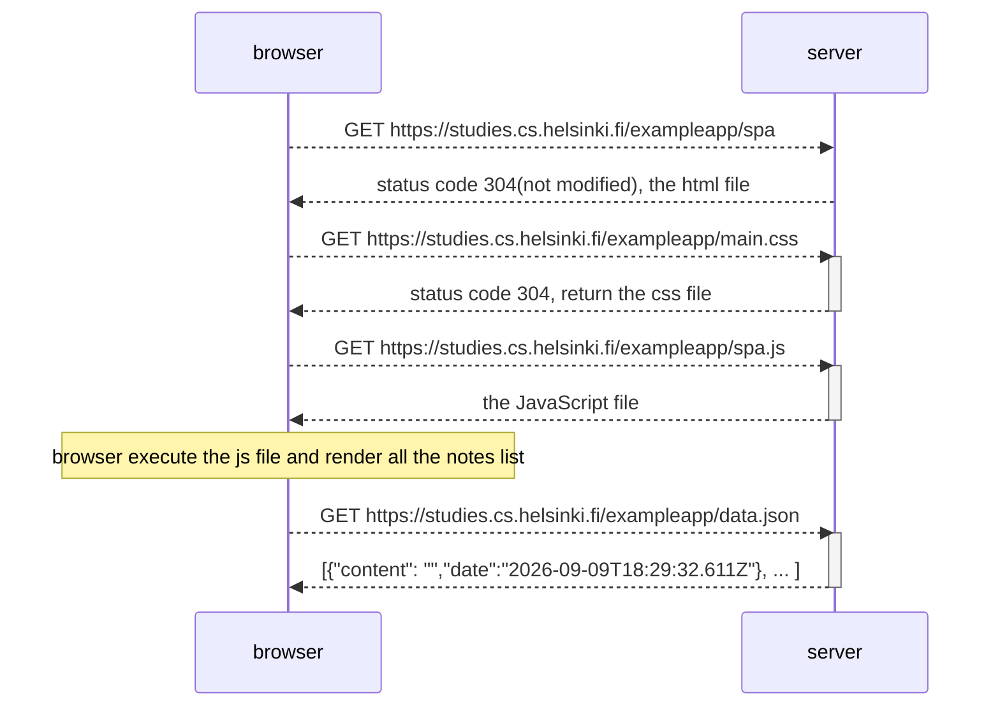

```mermaid
sequenceDiagram

    browser -->> server: GET https://studies.cs.helsinki.fi/exampleapp/spa
    server -->> browser: status code 304(not modified), the html file 

    browser -->> server: GET https://studies.cs.helsinki.fi/exampleapp/main.css
    activate server
    server -->> browser: status code 304, return the css file
    deactivate server
    
    browser -->> server: GET https://studies.cs.helsinki.fi/exampleapp/spa.js
    activate server
    server -->> browser: the JavaScript file
    deactivate server
    Note over browser: browser execute the js file and render all the notes list


    browser -->> server: GET https://studies.cs.helsinki.fi/exampleapp/data.json
    activate server
    server -->> browser: [{"content": "","date":"2026-09-09T18:29:32.611Z"}, ... ]
    deactivate server


```