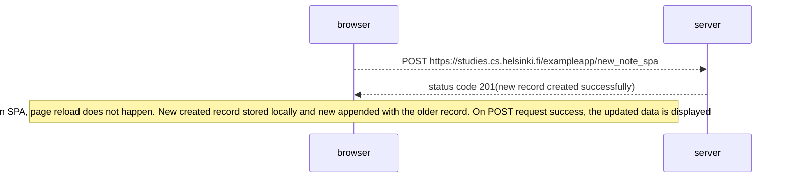

```mermaid
sequenceDiagram

    browser -->> server: POST https://studies.cs.helsinki.fi/exampleapp/new_note_spa
    server -->> browser: status code 201(new record created successfully)
    Note over browser: In SPA, page reload does not happen. New created record stored locally and new appended with the older record. On POST request success, the updated data is displayed

   
  


```